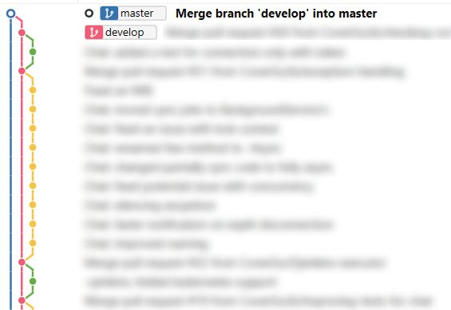

# How I Learned to Stop Worrying and Love Git

  Git is the most popular version control system now and for the foreseeable future. At the same time, most often developers use only the possible minimum of possibilities, since the Git commands are quite complex, and the documentation is verbose and covers all the features and does not suggest an optimal way to solve typical problems, nor does it demonstrate the unobvious useful features of this system. Here I want to share a very small set of commands, which is enough for me to completely control how my Git repositories look, and also solve 99% of the problems that arise.

* [Commit](#commit)
  * [What is commit?](#what-is-commit)
  * [How ideal commit looks like?](#how-ideal-commit-looks-like)
  * [Why simplest approach is not optimal?](#why-simplest-approach-is-not-optimal)
  * [How to make a good commit?](#how-to-make-a-good-commit)
* [Branches](#branches)
  * [Branch](#branch)
  * [Pull and Push](#pull-and-push)
  * [Merge and Rebase](#merge-and-rebase)
  * [Fast forward](#fast-forward)
* [Rewriting history](#rewriting-history)
  * [Change last commit](#change-last-commit)
  * [Change some commits on current branch](#change-some-commits-on-current-branch)
* [Tools](#tools)
  * [Git Bash](#git-bash)
  * [SourceTree](#sourcetree)
* [Flow](#flow)
  * [Master only](#master-only)
  * [Multibranch, merge only](#multibranch-merge-only)
  * [Multibranch, rebase and merge](#multibranch-rebase-and-merge)
  * [Git flow](#git-flow)
* [Issues](#issues)
  * [Reflog](#reflog)
  * [Cherry-pick](#cherry-pick)
* [Tips and tricks](#tips-and-tricks)
  * [Stash](#stash)
  * [Worktrees](#worktrees)
  * [Bisect](#bisect)
  * [Blame](#blame)
* [Other features](#other-features)
  * [Submodules and subtrees](#submodules-and-subtrees)
  * [Hooks](#hooks)
  * [Smart commits](#smart-commits)
  * [Multiple remotes](#multiple-remotes)
* [List of useful commands](#list-of-useful-commands)
  
## Commit
 Commits are a core Git feature that cannot be avoided. There are many ways to commit code - via the command line or various GUI tools.
Here I would like to first discuss good practices and then show you how to practice them.

### What is commit?
 Commits are like milestones, they store a certain state of files. This has many useful uses.
* A commit is a backup. You can go back to it if you completely messed things up, or you can just see what exactly you changed before everything broke.
* A commit is a means of communication. The commit contains the changes, and other programmers can apply those changes on their own copy of the code.
* Commits are a history of changes.
* A commit can serve as a description of the code and its changes, that is, documentation.

In most cases, commits only serve as a means of automatic code exchange.

### How ideal commit looks like?
Imagine if each commit had only one change, such as a new feature, code formatting, bug fix, unused code removal, or a little local refactoring. Also, each commit would have a message that clearly indicated the change in the title and other useful information regarding the change in the description.
In this case, commits serve as a history of changes and documentation, and those who read your code, for example, new team members, can see when, how and why you made changes. Of course, you can just comment the code, but comments in the code get outdated, and the messages in commits do not.
In addition, if each of your commit has only one purpose, you are much less likely to introduce accidental errors, because all changes are extremely visual. It also helps your reviewers, as they can see changes separately and see if they make sense in a given context.

### Why simplest approach is not optimal?
Many Git users make commits like this:
```
git add.
git commit -m "feature 1 and began to work on feature 2. Also fixed some bugs"
```
Or they do it using GUI tools. Sometimes they select individual files, but without checking them entirely.

The problem here is that there is a high probability of committing something that is not related to any topic from the commit message, or even committing code that was added only temporarily (for test / debug)
Another problem is that such a change cannot be verified, it covers several different topics at the same time, it is not clear what change in the code is for what.

### How to make a good commit?
Whenever you feel like committing something, I recommend using Atlassian SourceTree (or a similar GUI tool) to select the changes you want to make.
You can select whole files, or parts, or lines individually. This ensures that you can only choose what is relevant. You can do this from the command line, but I wouldn't call the process visual or easy.
Then you can commit using the same GUI, or on the command line:
```
git commit
```
 A text editor will open in which you can type the commit message. In it you should enter a title - the name of your change, then a more detailed description. For trivial commits, no description is needed.
```
git commit -m "<commit message>"
```
If you are a one-line commit message and does not need a detailed description.

Perhaps after that there will be some other changes that need to be committed. To do this, you need to create a separate commit by repeating the process.

It's perfectly okay if instead of just one commit, you end up with 3, 5 or more. You will spend a little more time doing this, but you will be absolutely sure what exactly you changed.

## Branches
Branch management is one of the most important parts of working effectively with Git.
The main actions that can be performed on branches are create and delete, push to and pull from remote, move, merge and [edit](#rewriting-history).

### Branch
This command is most useful for creating and deleting branches.
#### Create a branch
```
git branch <branch_name>                       # Create branch branch_name. Note that this branch will be created on the current commit.
git branch <branch_name> <commmitish>          # Create branch_name from <commitish>
```
Usually, when you create a branch, you want to quickly switch to it. There is a shortcut for it.
```
git checkout -b <branch_name>      # This command is equal to git branch <branch_name>; git checkeout <branch_name>
```
One special case if you want to repurpose an existing branch
```
git branch -f <branch_name> <commitish>
```
This command is equal to
```
git branch -D <branch_name>
git branch <branch_name> <commmitish> 
```

#### Remove a branch

##### To remove a merged branch (means, it is merged into some other branch and your commits in this branch will not be lost)
```
git branch -d <branch_name>
```
You cannot remove your current branch, though. Also, if you are using [worktrees](#worktrees), it counts too.

##### To remove unmerged branch (means that all commits of this branch are going to be discarded)
```
git branch -d -f <branch_name>
```
or, shorter
```
git branch -D <branch_name>
```
If this command results in data loss, don't be discouraged. [Reflog](#reflog) will help you restore everything as it was.

##### Remove remote branch
I recommend deleting branches automatically when pull requests are merged. Github, Gitlab and Bitbucket allow to set it in repository settings.
If you still need to delete a remote branch, it is better to use GUI tools such as SourceTree, so as not to make a mistake.
Sometimes a branch deleted on remote still appears as existing on local. The most efficient way to clear all such branches at once is to use `git fetch --prune`

### Pull and Push
These are pretty intuitive concepts, `pull` is used to download remote branches to a local repository. `Push` is the other way around, to upload local changes to a remote repository. Several options are possible for both.

#### Pull a new remote branch you don't have locally yet and check it out
Easiest way is to use this command
```
git checkout -t <remote>/<branch_name>
```

#### Pull last commits from a remote branch you have locally
```
git fetch <remote> <branch_name>:<branch_name>
```
or, to pull current branch
```
git pull
```

#### Pull remote branch, rebasing local commits
It can be default behaviour, set up in settings, or can be achieved by a command. This will rebase your local commits on the top of remote commits of the same branch.
```
git pull --rebase
```

#### Push a local branch to remote
```
git push -u <remote> <branch_name>
```

#### Push a local branch to remote, overriding remote changes
It is normal to use this command with your own topic branches, but not with common branches like `master` or `develop`.
```
git push -uf <remote> <branch_name>
```

### Merge and Rebase
Merge and rebase are the most complex commonly used commands. 
However, the degree of mastering and understanding of them affects how confidently you can manage your repository.
To some extent, these commands are similar.
 * They are used to combine two branches.
 * Their end result is the same (although the commit history is completely different).
 * They can lead to merge conflicts.
 
But they also have a key difference.
Merge adds changes from another branch to the end, so that all changes seem to happen in parallel, and then merged at the end.
Rebase adds changes from another branch to the beginning, so that all changes seem to happen sequentially - first the other branch, then the current one.
The very name of the command - rebase - seems to indicate that we are changing the base of the current branch, and moving it to another place.

#### Merge
To merge another branch into current branch:
```
git merge <other_branch_name>
```

#### Rebase
To rebase current branch to another branch:
```
git rebase <other_branch_name>
```

#### Merge confilicts
Quite often these commands lead to a merge conflict where the same lines are changed in both branches, and Git is unable to figure out which version is correct. And, in the case of rebase, this can happen several times. There are lots of GUI tools that help to resolve it, best of them show changes from both branches and the final result as well.

### Fast forward
Depending on settings, command `git merge` can try to fast-forward changes. This means that if merged branch is on the top of current, instead of merge commmit `git merge` produces linear history. If it is not intended result for you, you can use command
```
git merge --no-ff <other_branch_name> ## --no-ff means 'no fast-forward'
```
This command will force using merge commit. This can be important, for example, if you are using git flow and want to preserve history of merges.
You can also edit settings to change default behaviour for this command.

Depending on settings, `git pull` command may create a merge commit even if there is an opportunity for fast forward. To force fast-forward, you can use this commmand:
```
git pull --ff
```
You can also edit settings to change default behaviour for this command.

## Rewriting history
If you've never tried to rewrite the history of commits, or think it's too much trouble, this part for you. You need to know no more than two commands to be able to change, remove, rename, merge, or add commits on the current branch.

### Change last commit
Changing the last commit is a little easier than changing any other. There is a special command:
```
git commit --amend
```
This command adds staged changes to the last commit.

If you do not want to change the commit message, but only add changes, then you can improve the command:
```
git commit --amend --no-edit
```

### Change some commits on current branch
The most important command in this process is
```
git rebase -i HEAD~<number of commits you are going to change>
```
eg
```
git rebase -i HEAD~10
```

#### Prerequisits
Ensure that you don't have uncommited changes. You can commit it or [stash](#stash)

#### Editing history 
When you run this command, you will be shown text similar to the following in a text editor:
// TODO picture

```
p, pick = use commit
r, reword = use commit, but edit the commit message
e, edit = use commit, but stop for amending
s, squash = use commit, but meld into previous commit
f, fixup = like "squash", but discard this commit's log message
x, exec = run command (the rest of the line) using shell
d, drop = remove commit
```
These are the options available, for each commit individually

Most often you need `pick`, `edit` and `fixiup`.

If you need to delete a commit, you can simply delete it, or use `drop`.

It is possible to reorder commits, but be careful, it can lead to conflicts if one change overlaps with another.

`pick` means just to take a specific commit, no change

`edit` explains itself.
`fixup` - adds the contents of a commit to the previous commit, and throws out the commit message.

After that just save changes and exit the editor

#### Command execution
After you save the changes and exit the text editor, the command will start re-adding those commits, in the order you specified. 
The command will interrupt for `edit` - if you chose this option for a commit, the text editor will open again, where you can edit the commit message.

Also, there may be a conflict of changes. In this case, you can try to resolve this conflict and then execute the command
```
git rebase --continue
```
to continue
or, if it doesn't make sense anymore, you can abort the whole process and return to the original state with the command
```
git rebase --abort
```

#### Fixups
Sometimes it happens that you are working on something, periodically adding commits. And then you notice that you need to add a certain change several commits back
You can commit this change with a message like "A fixup to commit <commitname>" and then manually move that commit to the correct location with git rebase -i`. 
  
But there is a slightly more convenient way
```
git commit --fixup=<commit hash>
```
When you run `git rebase -i`, the commit will be added to the correct location automatically, with `fixup` key.

#### Is it too difficult?
This command may look too difficult at first, but after a little practice, you may find that power of this command is worth troubles of learning it. It gives you complete power over the history of changes you make, and you can assemble commits to clearly represent your intentions, instead of chronological changes.

## Flow
There are several approaches to branching in Git. Some are chosen for workflows, while others come from ignorance of better options. Here I will try to consider the most popular options, their scope, advantages and disadvantages.

### Master only


This option is perhaps the most popular for repos with very small teams. 

The obvious advantage of this process is its simplicity. Everything can be done with the most primitive tools, right from the IDE, without even knowing a single Git command. And if only one person needs to work with the repository, then the history of changes does not branch at all.

The disadvantage of this approach is poor scalability and the fact that it motivates to use the worst practices.

Poor scalability manifests itself in an increasing number of parallel branches and merge commits. This makes it very difficult to retrospectively track changes.

And the worst practices are, for example, the inability to effectively rewrite the history of local changes due to the constant inclusion of merge commits in the history. It is also impossible to determine which topic the commits are related to. This creates a chaotic Git culture.

### Multibranch, merge only


This option means that at the beginning of work on each feature, a new branch is created from the latest version of master. At the end of the work, the branch is merged into master.

This option is often used when a team using the previous option is implementing a code review. This leads to the need to use pull requests, and as a result, named branches.

The advantage is obviously that it allows pull requests. It also allows you to understand what topic each commit belongs to.

The disadvantages are poor scaling too. Each developer can have multiple branches, and if there are many developers, this leads to an unreadable history of changes in Git.

### Multibranch, rebase and merge


This option means that at the beginning of work on each feature, a new branch is created from the latest version of master. At the end of the work, the branch is rebased to the latest version of master (the latest at this point) and then the branch is merged into master.
That is, it looks like that the branch was created, and was immediately merged into master. At the same time, the history of changes looks almost linear, with the exception for merge commits, which show the checkpoints at which the new feature entered master.

In fact, this option is not very popular, but rather reflects my positive experience.

The advantage of this approach is that you have a very clear history of changes in Git and can be confident that your changes will merge easily.

The downside is that if you have merge conflicts, it might be easier to do without it and just merge.

### Git flow



This is a fairly complex system, although very effective in many cases. It is better to read about it [here](https://nvie.com/posts/a-successful-git-branching-model/). The main idea, in comparison with the previous two options, is that instead of master, the develop branch is used. And only tested commits from the develop branch are merged into the master branch. So the process is two-stage. While this process may not be suitable for everyone, many of the practices of this process, such as naming branches, are still worth learning.

## Tools

### Git Bash
Unix has excellent command line tools. However, Windows still does not have a good standard console, especially with support for Unix shells and commands. [Git for Windows](https://gitforwindows.org/) provides an alternative console that has all of this. Chances are good that you already have it installed, but not everyone knows and uses it.

### SourceTree
It is a free tool for Windows and Mac. It has many useful features, which are easier to find out about on the official [website](https://www.sourcetreeapp.com/). This is just one of many tools, other GUI tools usually have similar functionality.

While the command line may seem more convenient for most Git actions, some things are much more convenient to do with the GUI tools.

Here is the list of SourceTree features you can find useful:
  * Select files, parts of files, even individual lines to commit.
  * See changes with/without whitespaces included
  * Remove branches more safely
  * Easy access to stashes
  * Very intuitive representation of commit histoory

## Issues

### Reflog
This command allows you to fix problems such as accidentally deleting a branch, commit, stash, or just about any other change.

It's pretty simple to use.
git reflog
The command will list the recent commands and the corresponding commit checksums. After that, you can recreate the branch.
```
git branch <branch_name> <commit_checksum>
```

### Cherry-pick
This simple command is to take any commit from anywhere to current branch.
```
git cherry-pick <commit_checksum>
```
Usually it is useful for picking some changes from failed branches.

## Tips and tricks

### Stash
Quite often, it becomes necessary to temporarily hide uncommitted changes. This may be needed to pull a remote branch, or to rebase, or just to temporarily switch to another task.
To do it, use
```
git add .         # Without this command, `git stash` will only stash edited files, not added
git stash
```
To get it back, use
```
git stash apply
```
or
```
git stash pop
```
The last one is for the case if you also want to remove hidden copy

Stash works as a LIFO structure, so you can stash as many times as you want, and `git stash pop`/`git stash apply` will take the last added stash that left there.
It is also possible to create named stashes.

### Worktrees
Often it is necessary to work simultaneously with several branches of the same project. A possible solution is to just copy the folder. However, Git provides a better solution - the git worktree commands. These commands are used to manage different branches of the same repository in different folders, while remaining part of the same repository, with a single copy of the .git directory.

Example:
```
git worktree add <path> [<commit-ish>]
// Example
git worktree add ../Example_branch1 branch1
```
Show list of worktrees:
```
git worktree list
```
Remove a worktree:
```
git worktree remove ../Example_branch1

// Sometimes Git will not obey, because of some uncommited changes. If you don't need these changes anymore, add option -f
git worktree remove -f ../Example_branch1
```

### Bisect
Imagine that you have found a bug, and you know for sure that it was not in the previous version, and you have no idea what could be causing this bug.
A good start would be to find the commit that started things wrong. To find such a commit, use `git bisect` command, with which you can perform a binary search. More information [here](https://git-scm.com/docs/git-bisect).

### Blame
If you need to know who changed certain lines of a file and when, you can use GUI tools such as Git -> File history in Visual Studio or the Blame button on GitHub. But these tools only work in simple cases. If the file has been renamed, moved, copied, split or merged, these tools will only show the author and the time the file was created. Git has several commands that will untangle history in almost any case, regardless of moving code through files:
```
git blame <file> // This command will show you same result as GUI tools
git blame -C -M -w <file> // This command will ignore changes in whitespaces, and trace all code movements in different files
```
This command has many other options, for example, you can set a specific commit as a starting point.
In addition to this, you can use `git log -p <file>` with different options to see the history of changes.

### Multiple remotes
Sometimes the project workflow assumes that project contributors fork it to their own GitHub or GitLab account, and then offer their pull request from their fork to the main repository. In this case, it is necessary that the local repository works with two different remotes, so not only you have 'origin', but also other remotes. It is easy to do, full instructions are [here](https://git-scm.com/book/en/v2/Git-Basics-Working-with-Remotes).

## Other features

### Submodules and subtrees
If you need to include one repository in another, for example, include a third-party open-source library in your project, Git provides several ways:

More complex but clean - submodules. You can read more about this [here](https://www.atlassian.com/git/tutorials/git-submodule)

Simpler - subtrees. You can read more about this [here](https://www.atlassian.com/git/tutorials/git-subtree)

### Hooks
Hooks let you run scripts on specific events in Git. For example, you can run a linter before committing. You can read more about this [here](https://www.atlassian.com/git/tutorials/git-hooks)

### Smart commits
Smart commits allow you to manage issues in the issue tracker using a commit message. [An example](https://support.atlassian.com/bitbucket-cloud/docs/use-smart-commits/) how it may work.

## List of useful commands
```
git commit // Commit staged changes, input commit message interactively
git commit -m "<commit message>" // Commit staged changes, message is an argument
git commit --amend // Add staged changes to the last commit and edit its message
git rebase -i HEAD~<number of commits you are going to change> // Rewrite last n commits - edit messages, fixup, squash, reorder, delete
```
